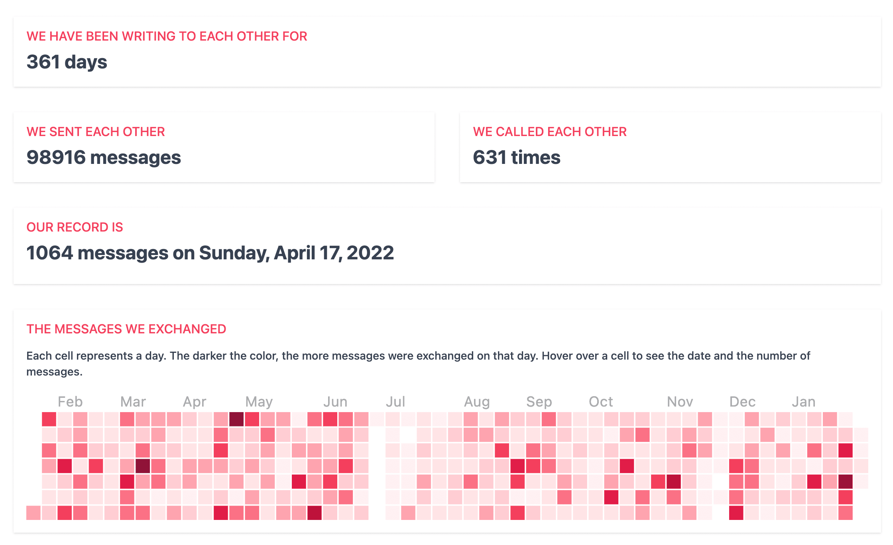

# Signal Your Love

The desktop app allows to display statistics of your [Signal Desktop](https://signal.org/download/) chats. The app is ideal for long-distance couples, friends, and anyone who wants to cherish their chat history with essential people. The app is built with ElectronJS and React.



**The Signal Desktop app must be installed**. The Signal Your Love app can only read messages that are present in Signal Desktop.

**Your conversation history never leaves your computer**. The app works offline with your local Signal Desktop database. No data is sent to us. If you are interested in technical details, please, read [the article](https://vmois.dev/query-signal-desktop-messages-sqlite/).

The official website: [https://signalyourlove.app](https://signalyourlove.app)

## MacOS

### Signing the app

Available documentation:

- [ElectronJS docs](https://www.electronjs.org/docs/latest/tutorial/mac-app-store-submission-guide#sign-apps-for-development)
- [Electron Forge docs](https://www.electronforge.io/guides/code-signing/code-signing-macos)

### Check entitelments for signed app

```bash
$ codesign --display --entitlements :- Signal\ Your\ Love.app
```

### Check if app is notarized

```bash
$ spctl -a -vvv -t install out/Signal\ Your\ Love-darwin-arm64/Signal\ Your\ Love.app
```
